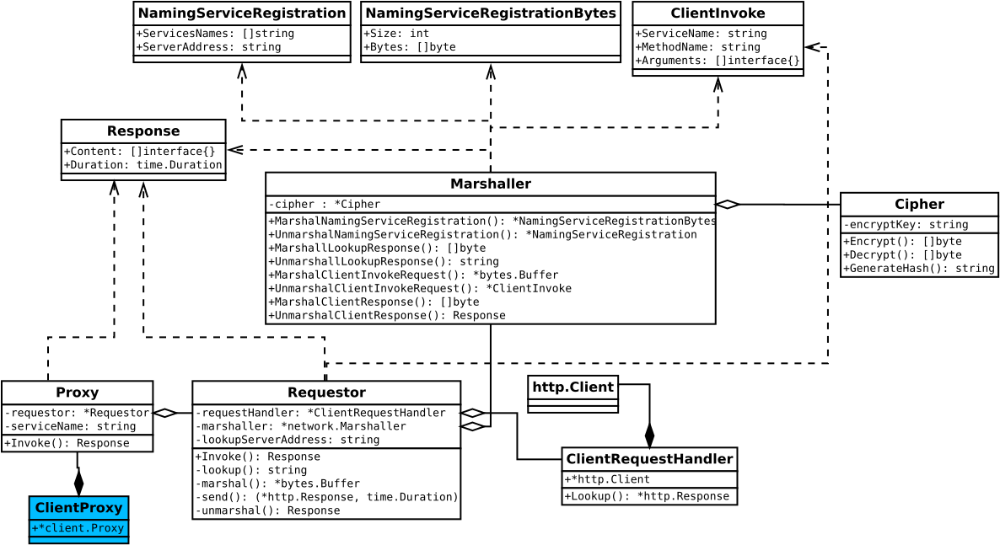
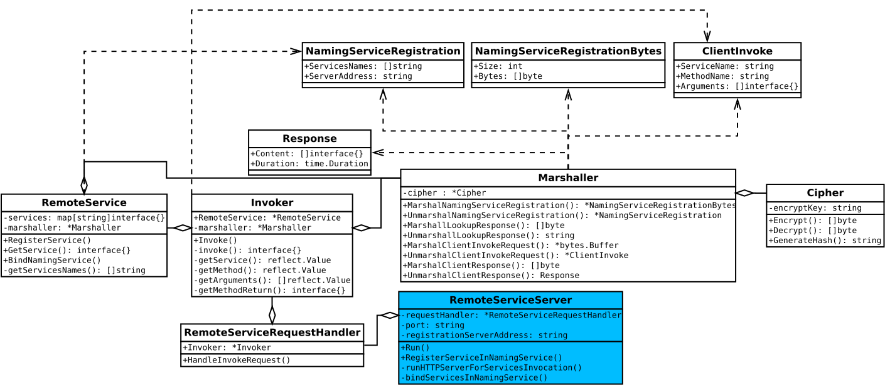
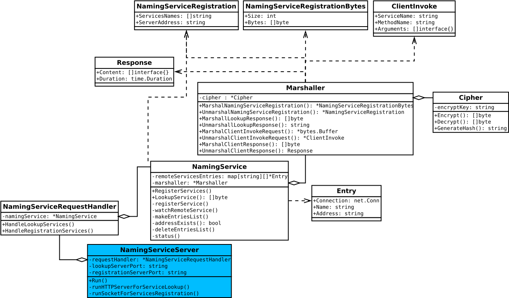

# About
This is a final project developed to attent the last requirement of master degree class [IN1118](https://sites.google.com/a/cin.ufpe.br/in1118/home) (Distribution Platform) at **CIn/UFPE**. It consists of a RPC based middleware that contains of a `Naming Service`, `Remote Service` and a `Client Proxy`. These three parts compose the solution that were written in Go language applying the principles of Remoting Patterns.

# How To

## Installation
```shell
# Commands to install the project
```

## Implementations
1. Implement a `struct` that has a method
2. Create its `Client Proxy`
3. Instantiate and run a new `Naming Service`
4. Instantiate a new `Remote Remote Service`, register in it a instance of the structure created before, then run.
5. Use the `Client Proxy` created to call the method.

Follows more details for each steps:

### Client Proxy
Below we have the `NLG` that contains the method `TextTokenize`, which will be running in the `Remote Service`.

```go
// file: ./nlg/nlg.go
package nlg

import (
	"strings"
)

// Names used to register this struct on remote service
const (
	NlgName      = "NLG"
	TextTokenize = "TextTokenize"
)

// NewNLG builds a new instance of NLG
func NewNLG() *NLG {
	return &NLG{}
}

// NLG handles operations for text over RPC calls
type NLG struct{}

// TextTokenize tokenizes a text
func (n *NLG) TextTokenize(content string) []string {
	var tokens []string
	mapTokens := make(map[string]struct{})
	words := strings.Split(content, " ")

	for _, word := range words {
		mapTokens[word] = struct{}{}
	}

	for key := range mapTokens {
		tokens = append(tokens, key)
	}

	return tokens
}
```

Here we have its `Client Proxy`:
```go
// file: ./nlg/nlg_proxy.go
package nlg

import (
	"time"

    "github.com/marlom-jobsom/gorpc/pkg"
)

// NewClient build new instance of Client
func NewClient(lookupServerAddress string, encryptKey string) *Client {
	return &Client{
		proxy:              pkg.NewClientProxy(lookupServerAddress, encryptKey, NlgName),
		methodTextTokenize: TextTokenize,
	}
}

// Client is the bridge to NLG remote instance
type Client struct {
	proxy              *pkg.ClientProxy
	methodTextTokenize string
}

// TextTokenize tokenizes a text
func (n *Client) TextTokenize(text string) []interface{} {
    // The implementation could treat the return to match with the original method.
    // For porpuse of simplification, it's just returning it
	return n.proxy.Invoke(n.methodTextTokenize, text)
}
```

Finally the main for the client:
```go
// file: ./cmd/client/main.go
package main

import (
	"log"

	"nlg"
	"github.com/marlom-jobsom/gorpc/pkg"
)

func main() {
	lookupServerAddress, encryptKey := pkg.GetClientArgs()
	nlgClient := nlg.NewClient(lookupServerAddress, encryptKey)
	log.Println(nlgClient.TextTokenize("Silence is is golden"))
}

```

### Remote Service
The main for `Remote Service`:

```go
// file: ./cmd/remote_service/main.go
package main

import (
	"nlg"
	"github.com/marlom-jobsom/gorpc/pkg"
)

func main() {
	port, registrationServerAddress, encryptKey := pkg.GetRemoteServiceArgs()
	remoteServiceServer := pkg.NewRemoteServiceServer(port, registrationServerAddress, encryptKey)
	remoteServiceServer.RegisterServiceInNamingService(nlg.NlgName, nlg.NewNLG())
	remoteServiceServer.Run()
}

```

### Naming Service
The main for `Naming Service`:

```go
package main

import (
	"github.com/marlom-jobsom/gorpc/pkg"
)

func main() {
	lookupServerPort, registrationServerPort, encryptKey := pkg.GetNamingServiceArgs()
	namingServiceServer := pkg.NewNamingServiceServer(lookupServerPort, registrationServerPort, encryptKey)
	namingServiceServer.Run()
}
```

## Running

### Naming Service
It must be the **first one** to be started

```shell
# Help message
$ go run cmd/naming_service_server/main.go --help
Usage of main:
  -encrypt_key string
    	The md5 encryptKey to encrypt/decrypt requests and responses (default "3a878ccc079a675df83041f1b695df6f")
  -lookup_server_port string
    	The service look-up server port (default ":0")
  -registration_server_port string
    	The service registration server port (default ":0")
```

```shell
# Running
$ go run cmd/naming_service_server/main.go
2018/11/27 08:47:04 Running remote service registration at "192.168.0.110:44729"
2018/11/27 08:47:04 Running remote service look-up at "192.168.0.110:44517"
```

### Remote Service
It must be the **second one** to be started.

```shell
# Help message
$ go run cmd/remote_service_server/main.go --help
Usage of main:
  -encrypt_key string
    	The md5 encryptKey to encrypt/decrypt requests and responses (default "3a878ccc079a675df83041f1b695df6f")
  -port string
    	The port where the server will run. (e.g: :8000) (default ":0")
  -registration_server_address string
    	The service registration server address
```

```shell
# Running
$ go run cmd/remote_service_server/main.go -registration_server_address "192.168.0.110:44729"
2018/11/27 08:49:22 Running remote service invoke at "192.168.0.110:33367"
2018/11/27 08:49:22 Registering remote services "[NLG]" from "192.168.0.110:33367"
```

### Client Proxy
```shell
# Help message
$ go run cmd/client/main.go --help
Usage of main:
  -encrypt_key string
    	The md5 encryptKey to encrypt/decrypt requests and responses (default "3a878ccc079a675df83041f1b695df6f")
  -lookup_server_address string
    	The service look-up server address
```

```shell
# Running
$ go run cmd/client/main.go -lookup_server_address "192.168.0.110:44517"
2018/11/27 08:52:01 [Silence is golden] 378.311µs
```

# Architecture
The pictures below presents the architectural vision of the project:

## Client Proxy


## Remote Service


## Naming Service


# Limitations (TODOs)

* Doesn't has a mechanism to generate and manage client keys for encrypt/decrypt requests;
* Still doesn't not support all basic Types in Golang;
* Missing Error handlers for following scenarios:
    * Nonexistence of a remote service
    * Nonexistence of a naming service
    * Wrong parameters given for a client invoke request
    * While marshal/unmarshal data
    * While writing data in the socket/request
* Missing unit tests
